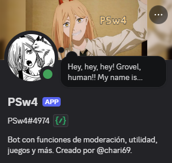

# PSw4

  

Este es el repositorio de PSw4, un bot de Discord en español creado por [Chari69](https://github.com/Chari69).

Es un bot privado, principalmente tiene funciones que en otros bots publicos ya no existen (reproducir musica decente con YT), y alguna utilidad mas.

Hago publico el codigo, sin embargo, por los momentos no tiene licencia, por lo que es propietario.

Este repositorio no tiene todos los archivos necesarios para funcionar (por los momentos).

## Funciones principales

- Reproducir música, en especial de YouTube.
- Comandos para interactuar con IA (OpenAI API)

## To-Do

- [ ] Optimizar el sistema de musica y descargas.
